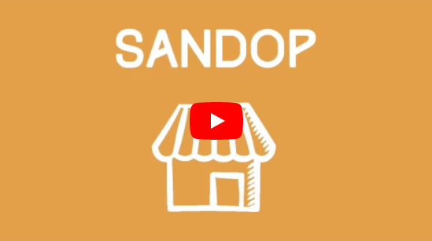

# Sandop
Sandop is the application that helps people to sell their old or unsed goods. The app alows to sell own products, look for already selling ones in your area and chat with the  owners.

The idea behind the project was the fact that the most common second-hand market in Finland is not translated to English language that cause difficulties for lots of tourits who come to the country first time.

Sandop use Firebase database and support signing in with own Facebook or Google accounts.

Created by Valerii Kan, Majid Aghaei and Mohammad Jawad Reza Bakhsh for Mobile and Social Computing course at the University of Oulu.

